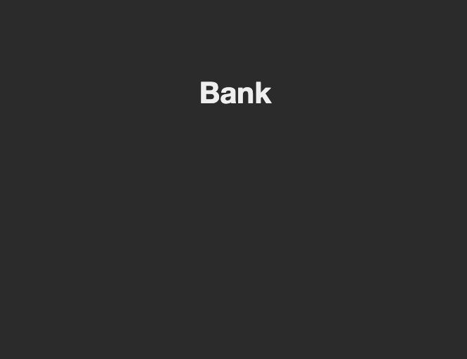
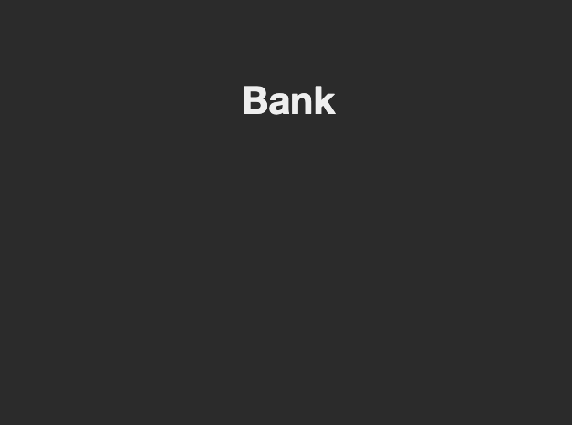
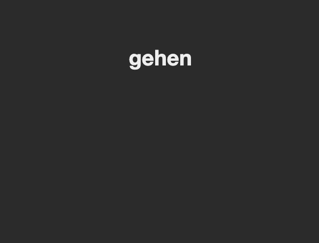
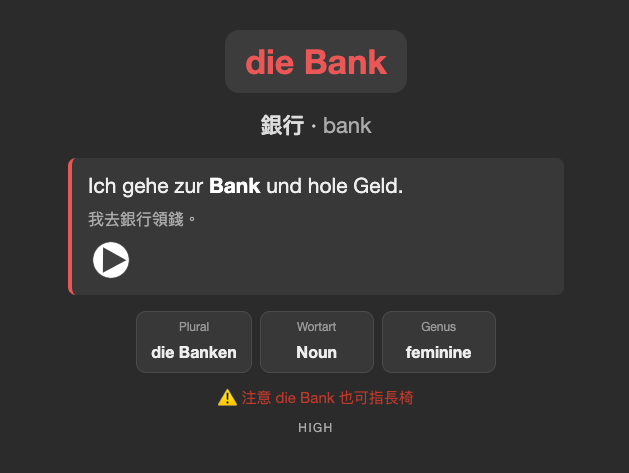
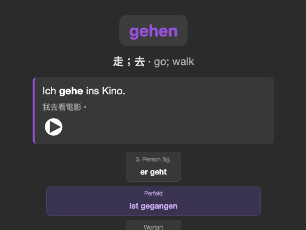

# German Vocab Anki — Note Type & Template


A clean, study-focused **Anki note type** for German vocabulary: the front shows the word **alone** to *train gender recall*, and the back reveals `der / die / das` in color — with example sentences, the **Perfekt** tense, and built-in audio.

> 為學德語設計的 Anki 卡片模板：正面只顯示單字、逼你回想性別，背面用顏色揭曉冠詞，並附例句、完成式與發音。

> This repo contains the **card design (templates + CSS)** and a small **demo deck** of self-made example cards.
> It does **not** include any copyrighted textbook word lists.

<p align="center">
  
</p>

## ✨ Features

- **Gender recall built in** — the front shows the word **only** (neutral color), so you must recall the article yourself. The back reveals `der / die / das` in color.
- **Color-coded by gender / category** — the article (or part of speech) is shown in color, so gender sticks visually:

     &nbsp;     
- **Example sentence box** — each card shows a natural example sentence with the **target word in bold**, plus a translation.
- **Grammar grid** — plural, 3rd-person singular, part of speech, gender — shown only when present.
- **Perfekt (perfect tense)** — a dedicated field for verbs (e.g. `ist gegangen`, `hat gegessen`), highlighted in purple.
- **Built-in audio (TTS)** — uses Anki's native `{{tts}}` tag, so **no media files** are needed. Works on desktop and mobile.
- **Dark mode** ready.

## 🖼 Screenshots

**Front** — only the word is shown, so you must recall the gender yourself:

| Noun | Verb |
|------|------|
|  |  |

**Back** — the article is revealed in color, with an example sentence, grammar grid, and (for verbs) the Perfekt:

| `die Bank` — feminine (red) | `gehen` — verb + Perfekt (purple) |
|------|------|
|  |  |

> Tip: you can also open [`preview/preview.html`](preview/preview.html) in a browser to see the design without Anki.


## 📦 What's in this repo

```
template/
  front.html      # front side (word only, hides the article)
  back.html       # back side (gender badge + sentence box + grammar grid)
  style.css       # all styling, incl. color system & dark mode
demo/
  notes.tsv       # 10 self-made example cards (tab-separated)
  FIELDS.md       # the 17 fields and the color system
preview/
  preview.html    # open in a browser to see the design (no Anki needed)
```

## 🚀 How to use

1. **Create the note type** in Anki: `Tools → Manage Note Types → Add → Clone: Basic`, name it `German Vocab Anki`.
2. **Add the fields** (in this exact order) via `Fields…`:
   `entry, article, word, plural, pos, gender, chinese, english, sentence_de, sentence_zh, conjugation_3sg, phrase, frequency_tag, confusion_note, color_tag, source_note, perfekt`
   (See [`demo/FIELDS.md`](demo/FIELDS.md) for what each field does.)
3. **Paste the templates** via `Cards…`:
   - Front Template ← `template/front.html`
   - Back Template ← `template/back.html`
   - Styling ← `template/style.css`
4. **Import the demo**: `File → Import → demo/notes.tsv`, set the note type to `German Vocab Anki`, field separator **Tab**, and map columns 1–17 in order.

## 📥 The full deck (AnkiWeb)

This repo is the **reusable note type & design**. My complete German A1 deck (1,200+ cards across 12 chapters, built on this template) is shared on AnkiWeb:

➡️ **AnkiWeb:** _coming soon_ <!-- replace with your shared-deck URL, e.g. https://ankiweb.net/shared/info/XXXXXXXX -->

Prefer to build your own? Use the template here and add your own words.

## 🔊 Audio (TTS)

Audio uses Anki's built-in `{{tts de_DE:...}}` — no sound files required.
You just need a **German voice installed on the device**:
- **iPhone**: Settings → Accessibility → Spoken Content → Voices → add German
- **Android**: Settings → System → Text-to-speech → install a German voice
- **Desktop**: uses the OS German voice. (Note: the **web version** of Anki does not auto-play TTS.)

## 📄 License

[MIT](LICENSE) — free to use, modify, and share. Attribution appreciated.

The **template and code** are MIT-licensed. The demo cards are original examples written for this repo.
Vocabulary you add yourself is your own responsibility regarding any source material.

## 🙏 Credits

Card design by Woody ([@woody8657](https://github.com/woody8657)). Built for [Anki](https://apps.ankiweb.net/).
